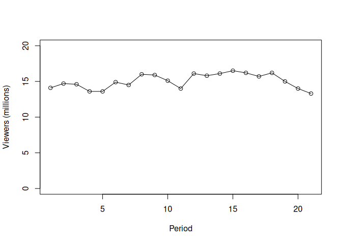

CS Core
================

<!-- "How foolish can you be? After starting your new lives in the Spirit, why are you now trying to become
perfect by your own human effort?" Galatians 3:3 (NLT) -->

### Statistics

<!-- TODO: Expand out the definitions for the broader categories and perhaps include formulas -->

Two major parts of statistics: descriptive statistics and statistical
inference. Descriptive statistics includes all of the definitions,
concepts, and formulas required to create graphical displays like
frequency distributions, graphs, location of data, spread of data, and
variability.

Statistical inference leverages probability and includes different
methods used to achieve point estimation, interval estimates, confidence
intervals, and hypothesis tests.

#### Concepts

Many situations require information about a large group of elements
(individuals, companies, voters, households, products, customers, and so
on). But, because of time, cost, and other considerations, data can be
collected from only a small portion of the group. The larger group of
elements in a particular study is called the **population**, and the
smaller group is called the **sample**.

As an example of statistical inference, let us consider the study
conducted by Norris Electronics. Norris manufactures a high-intensity
lightbulb used in a variety of electrical products. In an attempt to
increase the useful life of the lightbulb, the product design group
developed a new lightbulb filament. In this case, the population is
defined as all lightbulbs that could be produced with the new filament.
To evaluate the advantages of the new filament, 200 bulbs with the new
filament were manufactured and tested. Data collected from this sample
showed the number of hours each lightbulb operated before filament
burnout.

#### Definitions

**Population**: the set of all elements of interest in a particular
study

**Sample**: a subset of the population

#### Create and interpret frequency tables, and display data graphically and interpret graphs (e.g., histograms).

##### Categorical data

VirtualTourist provides ratings for hotels throughout the world. Ratings
provided by 649 guests at the Sheraton Anaheim Hotel, located near the
Disneyland Resort in Anaheim, California, can be found in the DATAfile
named *HotelRatings* (VirtualTourist website, February 25, 2013).
Possible responses were Excellent, Very Good, Average, Poor, and
Terrible.

1.  Construct a frequency distribution.

``` r
hotel_ratings_data <- read.csv("HotelRatings(Data).csv", header = TRUE)

ratings_frequency_table <- table(hotel_ratings_data$Rating)

# Rearrange categories to reflect, "Excellent, ...Terrible"
ratings_frequency_table <- ratings_frequency_table[c(2, 5, 1, 3, 4)]

ratings_frequency_df <- data.frame(ratings_frequency_table)

names(ratings_frequency_df)[names(ratings_frequency_df) == "Var1"] <- "Rating"

print(ratings_frequency_df)
```

    ##       Rating Freq
    ## 1 Excellent   187
    ## 2  Very Good  252
    ## 3    Average  107
    ## 4       Poor   62
    ## 5   Terrible   41

``` r
sum(ratings_frequency_table)
```

    ## [1] 649

2.  Construct a percent frequency distribution.

``` r
ratings_percent_frequency_table <- round(prop.table(ratings_frequency_table) * 100, 0)
ratings_percent_frequency_df <- data.frame(ratings_percent_frequency_table)

names(ratings_percent_frequency_df)[names(ratings_percent_frequency_df) == "Var1"] <- "Rating"
names(ratings_percent_frequency_df)[names(ratings_percent_frequency_df) == "Freq"] <- "Percent Freq"

print(ratings_percent_frequency_df)
```

    ##       Rating Percent Freq
    ## 1 Excellent            29
    ## 2  Very Good           39
    ## 3    Average           16
    ## 4       Poor           10
    ## 5   Terrible            6

``` r
sum(ratings_percent_frequency_table)
```

    ## [1] 100

3.  Construct a bar chart for the percent frequency distribution.

``` r
barplot(
  ratings_percent_frequency_table,
  xlab = "Rating",
  ylab = "Percent Frequency",
  # Increase range of y-axis scale
  ylim = range(pretty(c(0, ratings_percent_frequency_table)))
)
```

<!-- -->

4.  Comment on how guests rate their stay at the Sheraton Anaheim Hotel.

Almost three-quarters of the population had a rating of Very Good or
better while about one-quarter of the population gave the hotel a rating
of Average to Terrible.

5.  Results for 1679 guests who stayed at Disney’s Grand Californian
    provided the following frequency distribution.

<!-- -->

    ##      Rating Percent Freq
    ## 1 Excellent           48
    ## 2 Very Good           31
    ## 3   Average           12
    ## 4      Poor            6
    ## 5  Terrible            3

   Compare the ratings for Disney’s Grand Californian with the results
obtained for the Sheraton Anaheim Hotel.

A little more than three-quarters, about 80%, of the population for the
Disney’s hotel ratings study responded with a rating of Very Good or
better while about 20% of the population responded with ratings of
Average or lower. So compared to the Sheraton’s ratings, Disney’s Grand
Californian looks to have rated higher with patrons.

##### Quantitative data

*Entrepreneur* magazine ranks franchises using performance measures such
as growth rate, number of locations, startup costs, and financial
stability. The number of locations for the top 20 U.S. franchises follow
(*The World Almanac*, 2012). Use classes 0-4999, 5000-9999,
10,000-14,999, and so forth to answer the following questions.

1.  Construct a frequency distribution and a percent frequency
    distribution of the number of U.S. locations for these top-ranked
    franchises.

``` r
franchise_locations_data <- read.csv("Franchise(Data).csv", header = TRUE)
lower_class_limits <- c(0, 5000, 10000, 15000, 20000, 25000, 30000, 35000, 40000)

number_of_locations <- cut(
  # dig.lab argument is to prevent scientific notation on the class limits
  # [0, 5) = 0, 1, 2, 3, 4
  franchise_locations_data$LocationNumbers, breaks = lower_class_limits, dig.lab = 10, include.lowest = TRUE, right = FALSE
)

franchise_locations_frequency_table <- table(number_of_locations)
franchise_locations_frequency_df <- data.frame(franchise_locations_frequency_table)

names(franchise_locations_frequency_df)[names(franchise_locations_frequency_df) == "number_of_locations"] <- "# of Locations"

print(franchise_locations_frequency_df)
```

    ##   # of Locations Freq
    ## 1       [0,5000)   10
    ## 2   [5000,10000)    3
    ## 3  [10000,15000)    2
    ## 4  [15000,20000)    1
    ## 5  [20000,25000)    0
    ## 6  [25000,30000)    1
    ## 7  [30000,35000)    2
    ## 8  [35000,40000]    1

``` r
sum(franchise_locations_frequency_table)
```

    ## [1] 20

``` r
franchise_locations_percent_freq_table <- round(prop.table(franchise_locations_frequency_table) * 100, 0)
franchise_locations_percent_freq_df <- data.frame(franchise_locations_percent_freq_table)

names(franchise_locations_percent_freq_df)[names(franchise_locations_percent_freq_df) == "number_of_locations"] <- "# of Locations"
names(franchise_locations_percent_freq_df)[names(franchise_locations_percent_freq_df) == "Freq"] <- "Percent Freq"

print(franchise_locations_percent_freq_df)
```

    ##   # of Locations Percent Freq
    ## 1       [0,5000)           50
    ## 2   [5000,10000)           15
    ## 3  [10000,15000)           10
    ## 4  [15000,20000)            5
    ## 5  [20000,25000)            0
    ## 6  [25000,30000)            5
    ## 7  [30000,35000)           10
    ## 8  [35000,40000]            5

``` r
sum(franchise_locations_percent_freq_table)
```

    ## [1] 100

2.  Construct a histogram of these data.

``` r
hist(franchise_locations_data$LocationNumbers, breaks = lower_class_limits, main = "", xlab = "# of Locations")
```

<!-- -->

3.  Comment on the shape of the distribution.

The shape of the distribution in the histogram is skewed to the right,
and it indicates most of the franchises have less than 20,000 locations
while 20% of the sample of U.S. franchises have more than 20,000
locations.

#### Concepts

**Measures of central tendency** are statistical tools used to summarize
a dataset by identifying the center point or typical value within that
dataset. They help describe the general trend of data. The *mean
(average)* is the sum of all values divided by the number of values. It
represents the typical value of a dataset. The *median* is the middle
value when the data is arranged in ascending or descending order. It
separates the dataset into two equal halves.

The difference between each observation, *x<sub>i</sub>*, and the mean
($\bar{x}$ for a sample, $\mu$ for a population) is called a *deviation
about the mean*. For a sample, a deviation about the mean is written
(*x<sub>i</sub>* - $\bar{x}$); for a population, it is written
(*x<sub>i</sub>* - $\mu$). In the computation of the **variance**, the
deviations about the mean are *squared*.

#### Definitions

**Measures of central tendency**: summary measures that attempt to
describe a whole set of data with single values that represent the
middle or center of its distribution. There are three main measures of
central tendency: mean, median, and mode.

**Variance**: a measure of variability that utilizes all the data. The
variance is based on the difference between the value of each
observation (*x<sub>i</sub>*) and the mean.

#### Recognize, describe, and calculate means, medians, quantiles (location of data).

Over a nine-month period, OutdoorGearLab tested hardshell jackets
designed for ice climbing, mountaineering, and backpacking. Based on the
breathability, durability, versatility, features, mobility, and weight
of each jacket, an overall rating ranging from 0 (lowest) to 100
(highest) was assigned to each jacket tested. The following data show
the results for 20 top-of-the-line jackets (OutdoorGearLab website,
February 27, 2013).

    ##    Rating
    ## 1      42
    ## 2      66
    ## 3      67
    ## 4      71
    ## 5      78
    ## 6      62
    ## 7      61
    ## 8      76
    ## 9      71
    ## 10     67
    ## 11     61
    ## 12     64
    ## 13     61
    ## 14     54
    ## 15     83
    ## 16     63
    ## 17     68
    ## 18     69
    ## 19     81
    ## 20     53

1.  Compute the mean, median, and mode.

``` r
jacket_ratings_mean <- mean(jacket_ratings_data$Rating)
jacket_ratings_median <- median(jacket_ratings_data$Rating)
jacket_ratings_mode <- names(sort(-table(jacket_ratings_data$Rating)))[1]

print(jacket_ratings_mean)
```

    ## [1] 65.9

``` r
print(jacket_ratings_median)
```

    ## [1] 66.5

``` r
print(jacket_ratings_mode)
```

    ## [1] "61"

2.  Compute the first and third quartiles.

``` r
jacket_ratings_quartiles <- quantile(jacket_ratings_data$Rating, probs = c(0.25, 0.75))

print(jacket_ratings_quartiles)
```

    ## 25% 75% 
    ##  61  71

3.  Compute and interpret the 90th percentile.

``` r
# R's quantile function uses different formulas based on type argument
jacket_ratings_percentile <- quantile(jacket_ratings_data$Rating, probs = c(0.9), type = 6)

print(jacket_ratings_percentile)
```

    ##  90% 
    ## 80.7

*The Big Bang Theory*, a situation comedy featuring Johnny Galecki, Jim
Parsons, and Kaley Cuoco, is one of the most watched programs on network
television. The first two episodes for the 2011-2012 season premiered on
September 22, 2011; the first episode attracted 14.1 million viewers and
the second episode attracted 14.7 million viewers. The following table
shows the number of viewers in millions for the first 21 episodes of the
2011-2012 season (*The Big Bang Theory* website, April 17, 2012).

    ##              Air.Date Viewers..millions.
    ## 1  September 22, 2011               14.1
    ## 2  September 22, 2011               14.7
    ## 3  September 29, 2011               14.6
    ## 4     October 6, 2011               13.6
    ## 5    October 13, 2011               13.6
    ## 6    October 20, 2011               14.9
    ## 7    October 27, 2011               14.5
    ## 8    November 3, 2011               16.0
    ## 9   November 10, 2011               15.9
    ## 10  November 17, 2011               15.1
    ## 11   December 8, 2011               14.0
    ## 12   January 12, 2012               16.1
    ## 13   January 19, 2012               15.8
    ## 14   January 26, 2012               16.1
    ## 15   February 2, 2012               16.5
    ## 16   February 9, 2012               16.2
    ## 17  February 16, 2012               15.7
    ## 18  February 23, 2012               16.2
    ## 19      March 8, 2012               15.0
    ## 20     March 29, 2012               14.0
    ## 21      April 5, 2012               13.3

1.  Compute the minimum and maximum number of viewers.

``` r
print(min(big_bang_theory_data[,2]))
```

    ## [1] 13.3

``` r
print(max(big_bang_theory_data[,2]))
```

    ## [1] 16.5

2.  Compute the mean, median, and mode.

``` r
big_bang_theory_mean <- round(mean(big_bang_theory_data[,2]), 2)
big_bang_theory_median <- median(big_bang_theory_data[,2])
big_bang_theory_mode <- names(sort(-table(big_bang_theory_data[,2])))[1]

print(big_bang_theory_mean)
```

    ## [1] 15.04

``` r
print(big_bang_theory_median)
```

    ## [1] 15

``` r
print(big_bang_theory_mode)
```

    ## [1] "13.6"

3.  Compute the first and third quartiles.

``` r
big_bang_theory_quartiles <- quantile(big_bang_theory_data[,2], probs = c(0.25, 0.75), type = 6)

print(big_bang_theory_quartiles)
```

    ##   25%   75% 
    ## 14.05 16.05

4.  Has viewership grown or declined over the 2011-2012 season? Discuss.

``` r
plot(
  big_bang_theory_data[,2], type = "o", ylab = "Viewers (millions)", xlab = "Period", ylim = range(
    pretty(c(0, 18.0))
  )
)
```

<!-- -->

According to this graph, I’d say viewership for the show has stayed
fairly stable throughout the season.

#### Recognize, describe, and calculate variances, interquartile ranges (spread of data).

A sample of 10 NCAA college basketball game scores provided the
following data.

    ##       WinningTeam WinningPoints     LosingTeam LosingPoints WinningMargin
    ## 1         Arizona            90        Oregon            66            24
    ## 2           Duke             85     Georgetown           66            19
    ## 3   Florida State            75   Wake Forrest           70             5
    ## 4         Kansas             78       Colorado           57            21
    ## 5        Kentucky            71     Notre Dame           63             8
    ## 6      Louisville            65      Tennessee           62             3
    ## 7  Oklahoma State            72          Texas           66             6
    ## 8          Purdue            76 Michigan State           70             6
    ## 9        Stanford            77   Southern Cal           67            10
    ## 10      Wisconsin            76       Illinois           56            20

1.  Compute the mean and standard deviation for the points scored by the
    winning team.

``` r
ncaa_mean <- mean(ncaa_data$WinningPoints)
ncaa_standard_deviation <- round(sd(ncaa_data$WinningPoints), 2)

print(ncaa_mean)
```

    ## [1] 76.5

``` r
print(ncaa_standard_deviation)
```

    ## [1] 7.01

2.  Assume that the points scored by the winning teams for all NCAA
    games follow a bell-shaped distribution. Using the mean and standard
    deviation found in part (a), estimate the percentage of all NCAA
    games in which the winning team scores 84 or more points. Estimate
    the percentage of NCAA games in which the winning team score more
    than 90 points.

``` r
cat("z-score for 84 or more points in a game:", round((84 - ncaa_mean) / ncaa_standard_deviation, 2))
```

    ## z-score for 84 or more points in a game: 1.07

Assuming a bell-shaped distribution, and given the Empirical Rule, 68%
of the scores are within one standard deviation, so the remaining 32%,
or 16% of games would have the winning team score more than one standard
deviation above the mean or a score of 84 or more points.

``` r
cat("z-score for 90 or more points in a game:", round((90 - ncaa_mean) / ncaa_standard_deviation, 2))
```

    ## z-score for 90 or more points in a game: 1.93

Again, assuming a bell-shaped distribution, and given the Empirical
Rule, approximately 95% of the scores are within two standard
deviations, so the remaining 5%, or 2.5% of games would have the winning
team score more than two standard deviations above the mean or a score
of 90 or more points.

3.  Compute the mean and standard deviation for the winning margin. Do
    the data contain outliers? Explain.

``` r
ncaa_margin_mean <- mean(ncaa_data$WinningMargin)
ncaa_margin_standard_deviation <- round(sd(ncaa_data$WinningMargin), 2)

print(ncaa_margin_mean)
```

    ## [1] 12.2

``` r
print(ncaa_margin_standard_deviation)
```

    ## [1] 7.89

``` r
cat("z-score for lowest margin, 3:", round((3 - ncaa_margin_mean) / ncaa_margin_standard_deviation, 2))
```

    ## z-score for lowest margin, 3: -1.17

``` r
cat("z-score for highest margin, 24:", round((24 - ncaa_margin_mean) / ncaa_margin_standard_deviation, 2))
```

    ## z-score for highest margin, 24: 1.5

``` r
print("Given the Empirical Rule that states almost all values will be within 3 standard deviations given a
      bell-shaped distribution, and the calculated z-scores for the lowest and highest margin are within about
      1 standard deviation, then it can be said that there are no outliers in this dataset.")
```

    ## [1] "Given the Empirical Rule that states almost all values will be within 3 standard deviations given a\n      bell-shaped distribution, and the calculated z-scores for the lowest and highest margin are within about\n      1 standard deviation, then it can be said that there are no outliers in this dataset."

The Bureau of Transportation Statistics keeps track of all border
crossings through ports of entry along the U.S.-Canadian and
U.S.-Mexican borders. The data contained in the DATAfile named
*BorderCrossings* show the most recently published figures for the
number of personal vehicle crossings (rounded to the nearest 1000) at
the 50 busiest ports of entry during the month of August (U.S.
Department of Transportation website, February 28, 2013).

1.  What are the mean and median number of crossings for these ports of
    entry?

``` r
border_crossings_data <- read.csv("BorderCrossings(Data).csv", header = TRUE)

border_crossings_mean <- mean(border_crossings_data$"PersonalVehicles.1000s.")
border_crossings_median <- median(border_crossings_data$"PersonalVehicles.1000s.")

print(border_crossings_mean)
```

    ## [1] 173.24

``` r
print(border_crossings_median)
```

    ## [1] 89.5

2.  What are the first and third quartiles?

``` r
border_crossings_quartiles <- quantile(border_crossings_data$"PersonalVehicles.1000s.", probs = c(0.25, 0.75), type = 6)

print(border_crossings_quartiles)
```

    ##   25%   75% 
    ##  38.5 232.0

3.  Provide a five-number summary.

``` r
border_crossings_min <- min(border_crossings_data$"PersonalVehicles.1000s.")
border_crossings_max <- max(border_crossings_data$"PersonalVehicles.1000s.")
border_crossings_first_quartile <- quantile(border_crossings_data$"PersonalVehicles.1000s.", probs = c(0.25), type = 6)
border_crossings_third_quartile <- quantile(border_crossings_data$"PersonalVehicles.1000s.", probs = c(0.75), type = 6)

sprintf("Lowest value: %s, First Quartile: %s, Median: %s, Third Quartile: %s, Highest value: %s",
        border_crossings_min, border_crossings_first_quartile, border_crossings_median,
        border_crossings_third_quartile, border_crossings_max)
```

    ## [1] "Lowest value: 21, First Quartile: 38.5, Median: 89.5, Third Quartile: 232, Highest value: 995"

4.  Do the data contain any outliers? Show a box plot.

``` r
boxplot(border_crossings_data$"PersonalVehicles.1000s.", ylab = "Personal Vehicles (1000s)", ylim = range(pretty(c(0, 1200))))
# Indicate mean with black dot on box plot
points(border_crossings_mean, pch = 20, cex = 1.5)
```

<!-- -->

The box plot indicates the data is skewed to the right, or positive.
Three data items are considered outliers.
